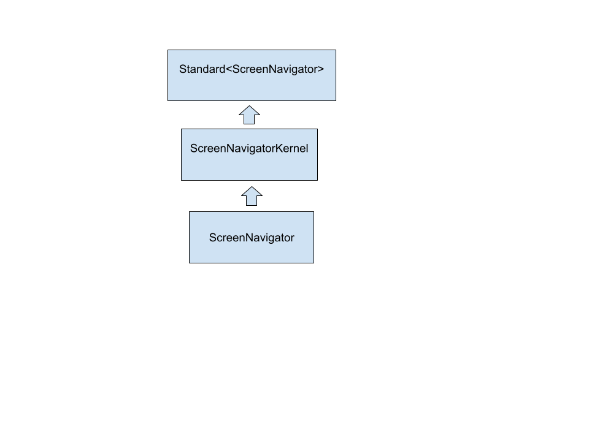

# Portfolio Part 3: Component Interfaces

- **Name**: Reyhan Can
- **Dot Number**: Can.22
- **Due Date**: 03/10/2026
## Assignment Overview

By now, you have had the opportunity to create three high-level component
designs and even prove that at least one of them is viable. Hopefully, at this
point, you've also received feedback on your designs. Now, you will have the
opportunity to put together the client-side interfaces, specifically the kernel
and enhanced interfaces.

The kernel interface provides the minimal functionality you would expect of
your data type. By convention, we would name our kernewhyl interface
`ComponentKernel`, where `Component` is the name of your component. As an
example, the kernel interface for the `NaturalNumber` component would be written
as `NaturalNumberKernel`, and it's skeleton would look as follows:

## Component Hierarchy



```java
public interface NaturalNumberKernel extends Standard<NaturalNumber> {
   ...
}
```

Similarly, the enhanced interfaces provides all of the methods that we want
to layer on top of the kernel. Again, by convention, we use the name of the
component directly for the enhanced interface. For example, `NaturalNumber`
would be the name of the enhanced interface, and its skeleton would look as
follows:

```java
public interface NaturalNumber extends NaturalNumberKernel {
   ...
}
```

# Changelog


All notable changes to this project will be documented in this file.

The format is based on [Keep a Changelog](https://keepachangelog.com/en/1.1.0/),
and this project adheres to [Calendar Versioning](https://calver.org/) of
the following form: YYYY.0M.0D.

## 2026.03.09

### Added
- Designed kernel interface ScreenNavigatorKernel
- Designed enhanced interface ScreenNavigator
- Added hierarchy diagram for ScreenNavigator component

### Updated

- Changed design to include ...


[natural-number-kernel]: https://cse22x1.engineering.osu.edu/common/doc/src-html/components/naturalnumber/NaturalNumberKernel.html
[natural-number]: https://cse22x1.engineering.osu.edu/common/doc/src-html/components/naturalnumber/NaturalNumber.html
[survey]: https://forms.gle/dumXHo6A4Enucdkq9
